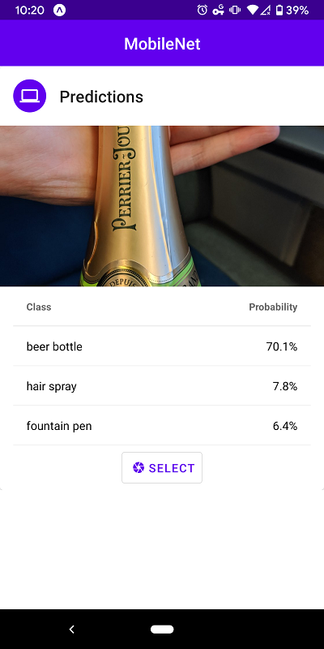

TensorFlow is a deep learning framework open sourced by Google in 2015.
Google introduced TensorFlow.js in 2018 and it lets developers to run/train
converted TensorFlow models on the browser or via Node.js.

Just last month, they released TensorFlow.js adapters for React Native which
brings TensorFlow to mobile applications. At the time of writing, the package is
still in alpha stage and not ready for production use.

This application is based on the example code provided by `tfjs-react-native`.

You can visit the demo here: https://expo.io/@t73liu/tfjs-starter

The complete code can be found here: https://github.com/t73liu/tfjs-starter

## Installation

The easiest way to get started would be installing expo and initializing an
empty project.

```bash
    yarn add global expo-cli
    # Creates a bare bones React Native application
    expo init example
    cd example
```

Now we can start up the application to verify that it works.

```bash
    expo start --tunnel
```

Next, we need to install the basic dependencies required by TensorFlow.js.

```bash
    yarn add @tensorflow/tfjs
    yarn add @tensorflow/tfjs-react-native@alpha
    yarn add @react-native-community/async-storage
    # Expo wrapper for yarn install; Downloads expo dependencies that work with current version
    expo install expo-gl
```

## Prediction

In the `App.js` file, we will begin by adding a `isTfReady` state and only show
the main screen after TensorFlow.js has finished loading. `AppLoading` is an Expo
component that will show the application's splash screen while the app is waiting
for resources to be prepared.

```js
import React, { Component } from "react";
import { Text, View } from "react-native";
import { AppLoading } from "expo";
import * as tf from "@tensorflow/tfjs";
import "@tensorflow/tfjs-react-native";

export default class App extends Component {
  state = {
    isTfReady: false,
  };
  prepApp = async () => await tf.ready();
  setAppReady = () => this.setState({ isTfReady: true });
  render() {
    if (!this.state.isTfReady) {
      return (
        <AppLoading
          startAsync={this.prepApp}
          onFinish={this.setAppReady}
          onError={console.warn}
        />
      );
    }
    return (
      <View>
        <Text>Placeholder</Text>
      </View>
    );
  }
}
```

Before we create a component to predict objects in an image, we still need to
download a pre-trained model. For this application we will be using MobileNet.
This model is a convolutional neural network that is efficient enough to be
run on mobile devices.

```bash
    yarn add @tensorflow-models/mobilenet
```

Download a small JPEG image (i.e. 400 by 300) and place it in the `assets`
folder. We will be predicting the object in this image.

Now that we can create the component to handle the prediction logic.

1. This component has a loading state since the model needs to be loaded
   and warmed up before it is ready to make predictions.
1. This component takes a single property (`source`) which refers to a local
   image and passes it to a TensorFlow.js util function that converts the image
   to binary data.
1. Another helper function converts the binary data into tensors (n-dimensional
   matrix).
1. Finally the model uses tensors as inputs and outputs an array of predictions.

```js
import React, { Component } from "react";
import { Text } from "react-native";
import * as tf from "@tensorflow/tfjs";
import { fetch as tfFetch } from "@tensorflow/tfjs-react-native";
import * as mobilenet from "@tensorflow-models/mobilenet";
export default class MobileNet extends Component {
  state = {
    isLoading: true,
    predictions: [],
  };
  async componentDidMount() {
    // Load and warms up MobileNet
    this.model = await mobilenet.load();
    await this.model.classify(tf.zeros([1, 224, 224, 3]));
    const predictions = await this.updatePredictions();
    this.setState({ predictions, isLoading: false });
  }
  updatePredictions = async () => {
    const { source } = this.props;
    if (this.model) {
      const imageAssetPath = Image.resolveAssetSource(source);
      const response = await tfFetch(
        imageAssetPath.uri,
        {},
        { isBinary: true }
      );
      const rawImageData = await response.arrayBuffer();
      const imageTensor = imageToTensor(rawImageData);
      const predictions = await this.model.classify(imageTensor);
      tf.dispose([imageTensor]);
      return predictions;
    }
  };
  render() {
    if (this.state.isLoading) <Text>Loading...</Text>;
    return <Text>{JSON.stringify(this.state.predictions)}</Text>;
  }
}
```

The `imageToTensor` helper function is implemented below. It decodes the binary
data using the `jpeg-js` library into an array of integers and removes
the alpha channel since MobileNet does not support/use that dimension.

```bash
    yarn add jpeg-js
```

```js
import * as tf from "@tensorflow/tfjs";
import { decode as jpegDecode } from "jpeg-js";
export function removeAlphaChannel(width, height, data) {
  const buffer = new Uint8Array(width * height * 3);
  let offset = 0; // offset into original data
  for (let i = 0; i < buffer.length; i += 3) {
    buffer[i] = data[offset];
    buffer[i + 1] = data[offset + 1];
    buffer[i + 2] = data[offset + 2];
    offset += 4;
  }
  return tf.tensor3d(buffer, [height, width, 3]);
}
export function imageToTensor(rawImageData) {
  const { width, height, data } = jpegDecode(rawImageData, { useTArray: true });
  return removeAlphaChannel(width, height, data);
}
```

Finally, we are ready to make predictions using the MobileNet. Replace the
placeholder text in `App.js` with our MobileNet component. The image that
was added to `assets` folder earlier will now be processed!

```js
<MobileNet source={require("./assets/sample.jpg")} />
```

## Finishing Touches

Before we wrap up, there are additional things we could do to clean up the
application to make it more presentable. You can find the source code and demo
in the References section.

- Add an UI component library to style the application using `react-native-paper`
- Add image picking functionality using `expo-image-picker`
- Add image resizing functionality to handle bigger pictures using `expo-image-manipulator`

That's it. It is very easy to add TensorFlow.js to your existing React Native
applications.

## Screenshots



## References

- [Code](https://github.com/t73liu/tfjs-starter)
- [Demo](https://expo.io/@t73liu/tfjs-starter)
- [TensorFlow.js](https://www.tensorflow.org/js/)
- [React Native](https://facebook.github.io/react-native/)
- [Expo](https://expo.io//)
