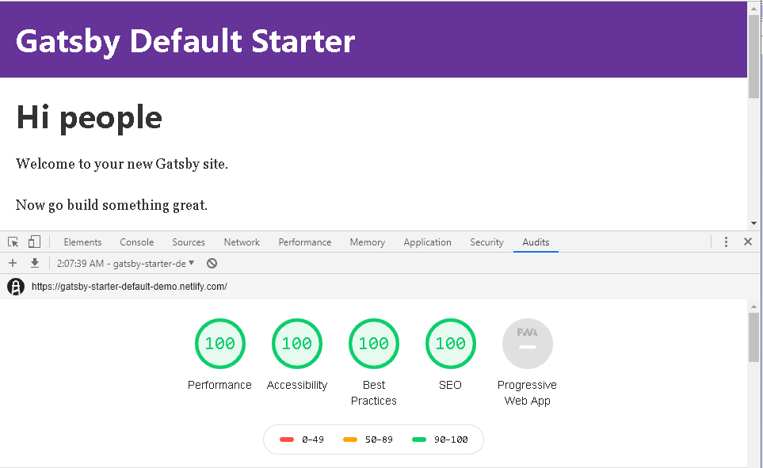

GatsbyJS is a static site generator that creates performant websites by default.
It uses React to render components and GraphQL to query various data sources
at build time. There are tons of official and third-party plugins that can be
easily plugged into your site to help fetch and transform data.

## Performance

Google Chrome has a built-in audit tool called Lighthouse that evaluates your
site on the following:

- Performance
  - First meaningful paint: how fast the page loads primary content onto the screen
  - Time to interactive: how fast the page becomes responsive
  - ...
- Accessibility
  - Image elements have `alt` attribute: relays information to blind users
  - `html` has a `lang` attribute: helps screen reader identify page language
  - ...
- Best Practices
  - Avoids deprecated APIs
  - Uses HTTPS
  - ...
- SEO
  - Page has a meta description: description displayed in Google's search results
  - Page has `title` element
  - ...



## Quick start

```bash
    # Uses yarn to install command line (interchangeable with npm)
    yarn global install gatsby-cli
    # Create a new Gatsby site using the default starter
    gatsby new my-default-starter https://github.com/gatsbyjs/gatsby-starter-default
    cd my-default-starter
    # Starts the project at localhost:8000
    yarn develop
```

At this point if you run the audit it will not have the same result as above.
It still needs to be deployed to a static site host first.

We will use GitHub pages to host the starter project so you will need a
repository for this project on GitHub.

Make the following addition to **gatsby-config.js**:

```js
module.exports = {
  // Replace 'sample' with your GitHub repo name
  pathPrefix: "/sample",
};
```

```bash
    # https://www.npmjs.com/package/gh-pages
    yarn add -D gh-pages
```

Add the following script to your **package.json**.

```json
{
  "scripts": {
    "deploy": "gatsby build --prefix-paths && gh-pages -d public"
  }
}
```

This builds the website for production use and creates a gh-pages branch on your
repository.

```bash
    # Project is reachable at https://username.github.io/sample
    yarn deploy
```

If you run the Google Chrome audit again, it will pass with flying colors.

## References

- [Personal GatsbyJS starter](/projects/gatsby-starter/)
- [GatsbyJS](https://www.gatsbyjs.org/)
- [React](https://reactjs.org/)
- [GraphQL](https://graphql.org/)
