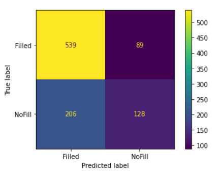

A gap up is when the opening price is greater than the previous closing price.
A gap down is when the opening price is lower than the previous closing price.
These gaps can occur because of major events, but most of the time its only
market fluctuations. These gaps typically fill within the day.

We can use machine-learning to predict which gaps have a high likelihood of
filling and make corresponding trades.

`scikit-learn` is a Python machine learning package which offers a variety of
classification algorithms (e.g. Logistic Regression, SVM, Decision Tree).

The complete code can be found here:
https://github.com/t73liu/trading-bot/blob/master/quant/DailyGapFill.ipynb

## Installation

The easiest way to get started would be installing Docker.

```bash
    # Pull Tensorflow image
    docker pull tensorflow/tensorflow:latest-jupyter

    # Run Tensorflow container
    docker run --detach \
     --name quant \
     --publish 8888:8888 \
     tensorflow/tensorflow:latest-jupyter

    # Access logs for Jupyter notebook URL
    docker logs quant

    # Access shell
    docker exec -it quant sh

    # Install required packages
    pip install pandas scikit-learn
```

## Prediction

Now we can create an empty Jupyter notebook. The data referenced can be downloaded
from https://www.macrotrends.net/stocks/charts/SPY/spdr-s-p-500-etf/stock-price-history.

```python
    import pandas as pd

    # Read CSV into pandas dataframe
    candles = pd.read_csv("SPY.csv", parse_dates=["date"])
    candles.head()
```

|     | date       | open    | high    | low     | close   | volume  |
|-----|------------|---------|---------|---------|---------|---------|
| 0   | 2000-01-03 | 99.6642 | 99.6642 | 96.7230 | 97.7734 | 8164300 |
| 1   | 2000-01-04 | 96.4919 | 96.8491 | 93.8764 | 93.9499 | 8089800 |
| ... |            |         |         |         |         |         |

Next, we need to calculate the opening gap and check if it filled within the day.

```python
    # Add column referencing the previous day's close
    candles["prev_close"] = candles["close"].shift(1)
    # Add column calculating the opening gap percent
    candles["gap_percent"] = (candles["open"] - candles["prev_close"]) / candles["prev_close"] * 100
    # Add column checking if the gap filled within the day
    candles["gap_filled"] = (candles["low"] <= candles["prev_close"]) & (candles["prev_close"] <= candles["high"])
    # Drop any rows with NA values (i.e. no previous close)
    candles.dropna(axis="rows", inplace=True)
    candles.reset_index(drop=True, inplace=True)
    # Drop any rows without sufficient trading opportunity (e.g. >= 0.05%)
    candles = candles.loc[abs(candles["gap_percent"]) >= 0.05].reset_index(drop=True)
    candles.head()
```

|     |       date |    open |    high |     low |   close |   volume | prev_close | gap_percent | gap_filled |
|----:|-----------:|--------:|--------:|--------:|--------:|---------:|-----------:|------------:|-----------:|
|  0  | 2000-01-04 | 96.4919 | 96.8491 | 93.8764 | 93.9499 | 8089800  | 97.7734    | -1.310684   | False      |
|  1  | 2000-01-05 | 94.0760 | 95.1474 | 92.2692 | 94.1180 | 12177900 | 93.9499    | 0.134220    | True       |
| ... |            |         |         |         |         |          |            |             |            |

```python
    gap_fill_count = candles.groupby("gap_filled").size()
    gap_fill_count[True]/gap_fill_count.sum()*100
```

Naively the daily gap fill rate is around **65%**.

Gap fills can be influenced by a variety of factors. Let's check the following:

- Day of the week
- Month
- Gap size

```python
    # Add column to track the day of the week
    candles["day_of_week"] = candles["date"].dt.day_name()
    # Add column to track the month
    candles["month"] = candles["date"].dt.month_name()
    # Bucket gap_percent by size
    cut_labels = [0.1, 0.2, 0.3, 0.4, 0.5, 0.6, 1]
    cut_bins = [0.05, 0.15, 0.25, 0.35, 0.45, 0.55, 0.65, 100]
    candles["gap_size"] = pd.cut(abs(candles["gap_percent"]), bins=cut_bins, labels=cut_labels)
```

|     | gap_filled | day_of_week |   month | gap_size |
|----:|-----------:|------------:|--------:|---------:|
|  0  | False      | Tuesday     | January | 1.0      |
|  1  | True       | Wednesday   | January | 0.1      |
| ... |            |             |         |          |

Now, we can group by each column and determine if there is a correlation to gap
fill.

```python
    # Similarly for "month" and "day_of_week"
    gap_fill_by_size = candles.groupby(["gap_size", "gap_filled"]).size()
    gap_fill_by_size.groupby("gap_size").apply(lambda g: g / g.sum() * 100)
```

```
    gap_size  gap_filled
    0.1       False         10.829960
              True          89.170040
    0.2       False         26.596980
              True          73.403020
    0.3       False         30.878187
              True          69.121813
    0.4       False         38.264300
              True          61.735700
    0.5       False         43.781095
              True          56.218905
    0.6       False         47.703180
              True          52.296820
    1.0       False         58.435438
              True          41.564562
```

As we can see here, gap size is negatively correlated with the gap fill rate.
There was no discernible impact from the day of the week and the month.

Now we can attempt to use Logistic Regression to see if we can accurately
predict the gap fill rate.

```python
    from sklearn.linear_model import LogisticRegression
    from sklearn.model_selection import train_test_split
    import sklearn.metrics as metrics

    # One-hot encode categorical features like day_of_week and month
    day_of_week = pd.get_dummies(candles["day_of_week"])
    month = pd.get_dummies(candles["month"])
    x = candles[["gap_size"]].join([day_of_week, month])
    # Replace True/False values with "Filled" and "NoFill"
    y = candles["gap_filled"].replace({True: "Filled", False: "NoFill"})
```

Categorical features like "month" needs to be translated to numeric variables
for some machine learning algorithms. We can translate each month to a
consecutive integers since they follow an ordinal relationship. If there is no
ordinal relationship, a column for each category value will need to be
added. The column will have a value of 1 if it belongs to that category and 0
otherwise.

```python
    # Split the training and test datasets (80/20 split)
    x_train, x_test, y_train, y_test = train_test_split(x, y, test_size=0.2, random_state=42)
```

`random_state` is a seed number that we set in order to produce consistent
results ([42](https://en.wikipedia.org/wiki/42_(number)#The_Hitchhiker's_Guide_to_the_Galaxy)
being the obvious choice). 

```python
    model = LogisticRegression()
    model.fit(x_train, y_train)
    predictions = logistic.predict(x_test)
    metrics.accuracy_score(y_test, logistic_predictions)
```

The resulting accuracy is around **69%**.

## Future Improvements

If we want to improve the accuracy further, we can look into the following:

- A more complex algorithm (SVM, Random Forest)
- Enriching the data via feature engineering
- Tuning the hyperparameters

Make sure to always backtest before risking your own money!

## Screenshots



## References

- [Code](https://github.com/t73liu/trading-bot/blob/master/quant/DailyGapFill.ipynb)
- [Scikit Learn](https://scikit-learn.org/stable/index.html)
