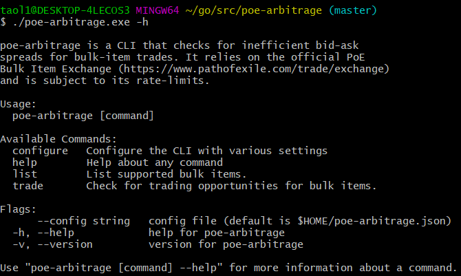

Go is a statically typed language open sourced by Google in 2009. It is typically
used for backend services and CLIs (command line interfaces).

Path of Exile is an action RPG similar to Diablo. Every 3-4 months, PoE launches
a new league which introduces a new game mechanic. Players have to create new
characters and start from scratch (i.e. no items carried over).

PoE also has an official trading site where players can buy/sell items. There is
no underlying service matching bids ("price buyer is willing to pay") and asks
("price seller is willing to accept") which can result in negative bid-ask
spreads (buyer is willing to pay more and seller is willing to take less).

In order to make a quick profit, I decided to code up a Go CLI that will
help detect these negative bid-ask spreads.

The complete code can be found here: https://github.com/t73liu/poe-arbitrage

## Installation

The easiest way to get started would be installing Go and initializing an
empty project with `cobra` (popular Go package for creating CLIs).

```bash
    # Install cobra CLI
    go get github.com/spf13/cobra/cobra
    # Make project directory
    mkdir poe-arbitrage
    cd poe-arbitrage
    # Initialize the Go project
    cobra init --pkg-name poe-arbitrage
    go mod init poe-arbitrage
```

Now we can start up the application to verify that it works.

```bash
    # Builds the CLI binary
    go build poe-arbitrage
    # Run the binary (Windows: ./poe-arbitrage.exe)
    ./poe-arbitrage
```

Running the binary should show the `poe-arbitrage` help screen which is automatically
generated by `cobra`. The starter code also assumes that you will be using
"$HOME/.poe-arbitrage" for the CLI config.

## Adding Commands

`cobra` recommends representing **commands** as actions, **args** as things
and **flags** as modifiers for actions. Lets add the ability to list tradable
items and search them via substring.

```bash
    # Adds sub-command: poe-arbitrage list
    cobra add list
```

At this point the project directory should look like the following:

```
    poe-arbitrage/
      cmd/
        list.go
        root.go
      main.go
      go.mod
```

`cmd/root.go` will contain startup logic that will be shared across all commands
such as initializing/parsing config file and persistent flags that will be
accessible to its sub-commands.

`cmd/list.go` will handle printing tradable items and support one flag (--name, -n)
for searching tradable items by substring.

GGG has custom string IDs for every bulk item. These IDs are required for making
API requests to fetch trade details. You can find these IDs by visiting their
exchange site and looking at the HTML, just right-click and "Inspect Element" one
of the tradable items.

```
<div data-id="alt" title="" class="exchange-filter-item" data-original-title="Orb of Alteration">
  
</div>
```

Let's save a few item IDs and names to a JSON file. `viper` is a config management
package that supports other file formats such YAML, etc. I generally prefer JSON
since its commonly used, readable and does not rely on white-space.

```json
    {
      "bulkItems": [
        {
          "id": "alt",
          "name": "Orb of Alteration",
        },
        ...
      ]
    }
```

Now we need to read in this file at start-up which will require making the
following edit in `cmd/root.go`.

```go
    func initConfig() {
      // Find home directory.
      home, err := homedir.Dir()
      if err != nil {
        fmt.Println(err)
        os.Exit(1)
      }
      // Search config in home directory with name ".poe-arbitrage"
      viper.AddConfigPath(home)
      viper.SetConfigType("json")
      viper.SetConfigName(".poe-arbitrage")
    }
```

Now we will be need to access the underlying config. `viper` behaves similar to
a singleton which means you can refer to it in `cmd/list.go` without having to
pass an object/instance.

```go
    // File: cmd/list.go
    // Struct used to serialize JSON
    type BulkItem struct {
      Id        string `json:"id"`
      Name      string `json:"name"`
    }
    type Config struct {
      BulkItems       map[string]BulkItem `json:"bulkItems"`
    }
    var listCmd = &cobra.Command{
      Use:   "list",
      Short: "List tradable items",
      RunE: func(cmd *cobra.Command, args []string) error {
        // Reads JSON into Config struct
        var config Config
        if err := viper.Unmarshal(&config); err != nil {
          fmt.Println("Failed to parse config:", err)
          return err
        }
        // Prints tradable items
        for _, item := range config.BulkItems {
          fmt.Printf("%+v\n", item)
        }
        return nil
      },
    }
```

If everything was done correctly, you should be able to build the CLI binary
and run `poe-arbitrage list` to print out tradable items.

Lets add filtering functionality to the list command by adding the --name flag.

```go
    // File: cmd/list.go
    func init() {
      rootCmd.AddCommand(listCmd)

      listCmd.Flags().StringP(
        "name"
        // One letter alternative (i.e. -n)
        "n"
        // Default value
        "",
        // Help text for the flag
        "List items containing the provided string"
      )
    }
```

Now you should be able to see the --name/-n flag show up in the generated help
text. In order to implement the filtering logic, we will need to add the excerpt
to our `listCmd.RunE` function.

```go
    // Fetch the value of --name
    name, err := cmd.Flags().GetString("name")
    if err != nil {
      fmt.Println("Failed to retrieve --name value:", err)
      return err
    }
    // Filter items by name
    trimmedStr := strings.TrimSpace(name)
    for _, item := range config.BulkItems {
      if trimmedStr == "" || strings.Contains(item.Name, trimmedStr) {
        fmt.Printf("%+v\n", item)
      }
    }
```

You should be able to run the following commands with a newly built binary:

```bash
    # List all tradable items
    ./poe-arbitrage list
    # List all tradable items with "orb" in the name
    ./poe-arbitrage list -n "orb"
    ./poe-arbitrage list --name "orb"
    # Show help for the list command
    ./poe-arbitrage list -h
    ./poe-arbitrage list --help
    # Show help for the CLI
    ./poe-arbitrage
    ./poe-arbitrage -h
    ./poe-arbitrage --help
```

## Finishing Touches

I added a couple of other commands in order to improve the overall usability.
You can find the source code in the References section.

- Add a `configure` sub-command for editing basic config options via the CLI
- Add a `trade` sub-command for fetching trade listings from PoE exchange
- Filter out AFK players and ignored players
- Sort trades by price and stash size

As of writing, I am still figuring out how best to automatically analyze
trades for arbitrage opportunities. This will likely involve representing the
trading paths as a directed cyclic graph and looking for profitable cycles 🤔.

## Screenshots



## References

- [POE Arbitrage](/projects/poe-arbitrage/)
- [Code](https://github.com/t73liu/poe-arbitrage)
- [Go](https://golang.org/)
- [Cobra](https://github.com/spf13/cobra/)
- [Viper](https://github.com/spf13/viper/)
