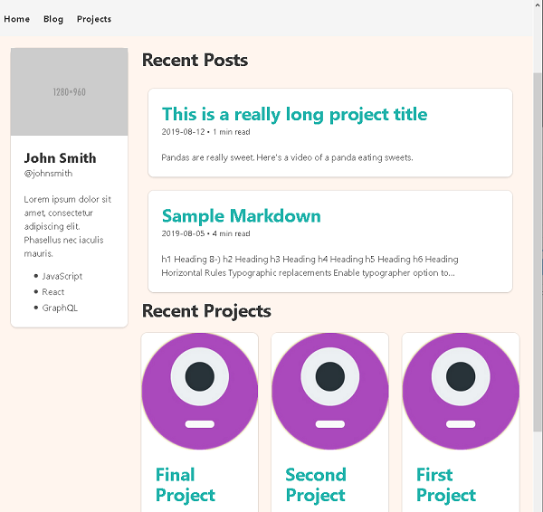

## Technologies

**GatsbyJS** is a static site generator that creates performant websites by default.
It uses React to render components and GraphQL to query various data sources at build time.
There are tons of official and third-party plugins that can be easily plugged into your site to help fetch and transform data.

## Screenshots

