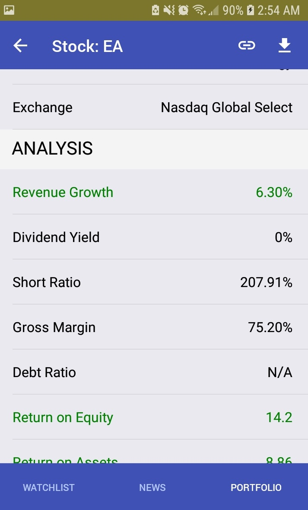

## Description

This is a mobile app built using React Native. This project mainly uses the Expo package
which provides useful JS components and does not require writing any native code (Java/Swift).

The app is built on top of the free IEX Trading API which provides ticker data for
NASDAQ and NYSE. It has three main features: analyzing tickers, providing news and
tracking portfolio value.

Note: This project is inactive (archived) since the free API is no longer available.

## Technologies

**React Native** is a UI framework built by Facebook that lets you build Android and iOS apps.
It uses the same API as React and is written in JavaScript.

**TypeScript** is a superset of JavaScript and being maintained by Microsoft.
It brings static typing to JavaScript and helps find bugs at compile time.

## Features

- Redux for state management
- Redux-Persist to persist watchlist and portfolio to local storage
- NativeBase for UI components
- React-Navigation for routing and tabs
- Prettier and TSLint for code style
- IEX Trading API (deprecated) for ticker data

## Screenshots

