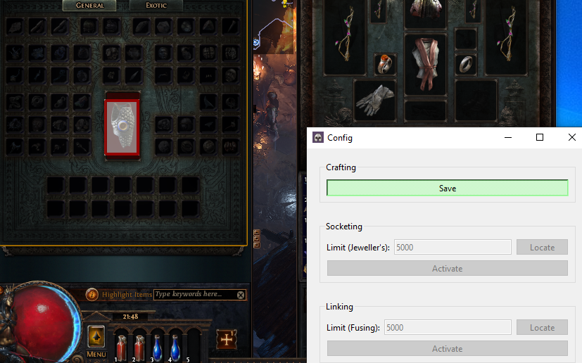

Python offers bindings for Qt which allows us to create desktop apps. We can
create GUI tools to automate repetitive tasks. This post is purely educational.
Scripting goes against Path of Exile's Terms of Service.

Path of Exile is an action RPG similar to Diablo. It is a very click heavy game
and there are a few activities that require thousands of clicks. The developers
recently addressed some of these issues with a quality of life update.

One activity is "six linking" an item which involves ~1500 clicks on average
while holding down the `Shift` button.

## Scripting

Assuming you already have Python installed, we can set up the basic
functionality without implementing a GUI.

`PyAutoGui` provides most of the necessary functionality for interacting with
the game window.

```python
import pyautogui

def hold_shift():
    pyautogui.keyDown("shift")

def release_shift():
    pyautogui.keyUp("shift")

def click_mouse(button="left"):
    pyautogui.mouseDown(button)
    pyautogui.mouseUp(button)

def move_mouse(x, y, duration=0.1):
    pyautogui.moveTo(x, y, duration)
```

Assuming we know the in-game coordinates of the items, we need to take the
following steps:

1. Move mouse to hover over currency item.
2. Hold shift.
3. Click right mouse button to select the item.
4. Move mouse to crafting location.
5. Left click mouse. Repeat until "exit" key is pressed.
6. Release shift.

The overall logic will look something like this:

```python
def apply_fusings(currency_location: Location, crafting_location: Location):
    logging.info("Start linking")
    move_mouse(currency_location)
    hold_shift()
    click_mouse(button="right")
    move_mouse(crafting_location)
    while not is_exit_pressed():
        click_mouse()
    release_shift()
```

Detecting the "exit" key will simply be using a `keyboard` package to listen for
a specific keypress.

This script can easily be tested by using `pyautogui.position()` to identify
where to click and putting the game in windowed mode.

## GUI

Once the script is working, we can create a simple GUI using `PySide6` which
will allow us to update the item locations without having to change any code.
Here is some basic code for setting up the basic app.

```python
class MainWindow(QMainWindow):
    def __init__(self):
        super().__init__()
        self.setWindowTitle("Config")
        self.main_widget = QWidget(self)
        self.main_widget.setFocus()
        self.setCentralWidget(self.main_widget)
        self.main_layout = QVBoxLayout()
        self.main_widget.setLayout(self.main_layout)

        # Adds the linking widget to the main window.
        self.linking_form = LinkingForm(self)
        self.main_layout.addWidget(self.linking_form)

class LinkingForm(QWidget):
    def __init__(self, parent: "MainWindow"):
        super().__init__(parent)
        self.main_window = parent
        self.target_window: TargetWindow | None = None

        grid = QGridLayout()

        # GUI elements to limit the number of items to use.
        grid.addWidget(QLabel("Limit (Fusing):"), 0, 0)
        self.limit_edit = QLineEdit(str(self.currency_limit))
        self.limit_edit.editingFinished.connect(self.update_limit)
        grid.addWidget(self.limit_edit, 0, 1)

        # GUI elements to update mouse target location.
        self.locate_button = QPushButton("Locate")
        self.locate_button.setCheckable(True)
        self.locate_button.clicked.connect(self.locate)
        grid.addWidget(self.locate_button, 0, 2)

        # GUI elements to activate the linking script.
        self.activate_button = QPushButton("Activate")
        self.activate_button.setCheckable(True)
        self.activate_button.clicked.connect(self.activate)
        grid.addWidget(self.activate_button, 1, 0, 1, 3)

    def activate(self, _):
        try:
            apply_fusings(currency_location, crafting_location)
        except Exception:
            logging.exception("Failed to apply script")

    def locate(self, _):
        self.toggle_target_window(self.location)

    def update_limit(self):
        limit_str = self.limit_edit.text()
        self.currency_limit = parse_int(limit_str)
        self.limit_edit.setText(str(self.currency_limit))

def main():
    app = QApplication(sys.argv)
    w = MainWindow()
    w.show()
    return app.exec()
```

The `TargetWindow` is essentially a borderless, transparent window used to set
cursor locations. It needs to be dragged over the desired region.

```python
class TargetWindow(QWidget):
    def __init__(self, location: Location, border: int = 4):
        super().__init__()
        self.setGeometry(location.x, location.y, location.width, location.height)
        self.setWindowOpacity(0.5)
        self.setWindowFlags(Qt.WindowType.FramelessWindowHint)
        self.border = border
        self.border_padding = self.border // 2
        self.rect_width = self.frameGeometry().width() - self.border
        self.rect_height = self.frameGeometry().height() - self.border

    def paintEvent(self, _):
        painter = QPainter(self)
        painter.setPen(QPen(Qt.GlobalColor.red, self.border, Qt.PenStyle.SolidLine))
        painter.drawRect(
            self.border_padding, self.border_padding, self.rect_width, self.rect_height
        )

    def mousePressEvent(self, event):
        self.old_position = event.globalPosition()

    def mouseMoveEvent(self, event):
        new_position = event.globalPosition()
        delta = (new_position - self.old_position).toPoint()
        self.move(self.x() + delta.x(), self.y() + delta.y())
        self.old_position = new_position
```

## Building

Once the GUI and scripting logic works, the final step is to package it as an
executable so users do not have to build it from scratch. This can easily be
done using `pyinstaller`.

```sh
pyinstaller main.py --onefile --name example
```

## Screenshots



## References

- [PyQt](https://doc.qt.io/qtforpython-6/)
- [PyAutoGui](https://pyautogui.readthedocs.io/en/latest/)
- [PyInstaller](https://pyinstaller.org/en/stable/)
