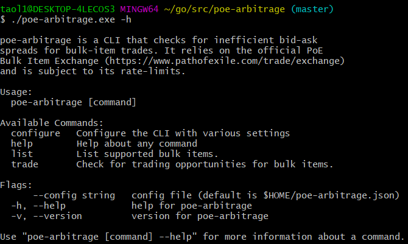

## Description

CLI tool to detect arbitrage opportunities by taking advantage of inefficient
bid-ask spreads in the Bulk Item Exchange. This tool relies on the exchange API
which is not officially supported by GGG.

## Technologies

**Go** is a statically typed language open sourced by Google in 2009. It is typically
used for backend services and CLIs (command line interfaces).

**cobra** is a Go package for creating CLI applications. It offers a variety of
features such as creating sub-commands, typo suggestions and automatic help generation.

**viper** is a Go package for configuration management. It supports JSON, TOML,
YAML, etc. and reading from environment variables.

## Features

- Fetch bulk trades from PoE Bulk Exchange API
- Exclude AFK users by default
- Ignore users
- Favorite users
- ~Print whispers for profitable arbitrage opportunities~

## Screenshots

